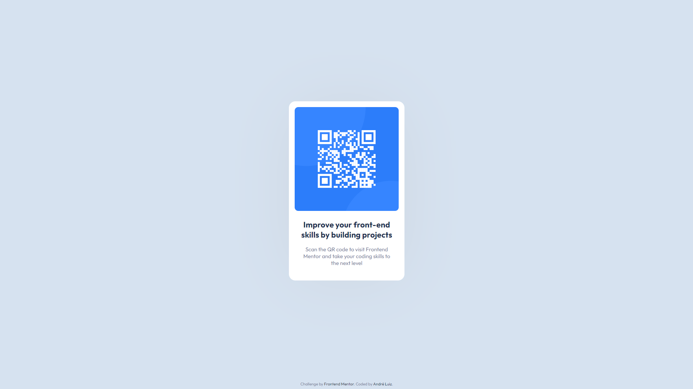

# Frontend Mentor - QR code component solution

Essa é a solução do desafio [QR code component challenge on Frontend Mentor](https://www.frontendmentor.io/challenges/qr-code-component-iux_sIO_H). do Frontend Mentor. 

## Índice

- [Overview](#overview)
  - [O desafio](#o-desafio)
  - [Screenshots](#screenshots)
  - [Links](#links)
- [Meu processo](#meu-processo)
  - [Feito com](#feito-com)
  - [O que eu aprendi](#o-que-eu-aprendi)
  - [Continuação do meu desenvolvimento](#continuação-do-meu-desenvolvimento)
  - [Recursos úteis](#recursos-úteis)
  - [Autor](#autor)

**Note: Delete this note and update the table of contents based on what sections you keep.**

## Overview

### O Desafio

Criar um cartão com um QR Code com um titulo e uma breve descrição.

### Screenshot

### Links

- Repositório: [GitHub - QR code component solution](https://your-solution-url.com)
- Live Site URL: [GitHub Pages](https://your-live-site-url.com)

## Meu processo

### Feito com

- HTML5
- CSS 
- Flexbox
- Variáveis de root

### O que eu aprendi

Com esse desafio pratiquei a centralização de elementos e o uso de sombras em objetos.

### Continuação do meu desenvolvimento

Estou aprimorando a centralização de elementos, a semântica do meu código, pra então começar meus projetos com JS.

### Recursos úteis

- [Box Shadow CSS Generator](https://cssgenerator.org/box-shadow-css-generator.html) - Esse site é excelente para gerar sombras para objetos.

## Autor

- Frontend Mentor - [andre-pixioline](https://www.frontendmentor.io/profile/andre-pixioline)
- Instagram - [@andrepixioline](https://www.instagram.com/andrepixioline/)
- Linkedin - [André Luiz Pixioline](https://www.linkedin.com/in/andre-pixioline/)